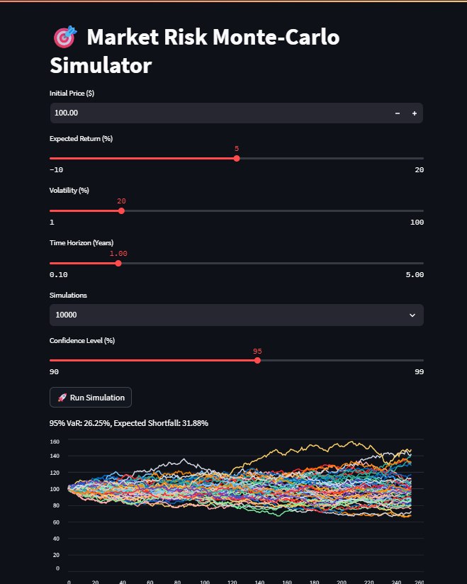

#  Market Risk Monte-Carlo Simulator  
**GBM-based risk engine computing Value at Risk (VaR) and Expected Shortfall (ES)**

---

##  Project Description
This project simulates equity price paths using **Geometric Brownian Motion (GBM)** and evaluates portfolio tail risk using:

- **Value at Risk**
- **Expected Shortfall**
- **Skewness & Kurtosis** to identify fat-tail risk behavior

It includes an interactive **Streamlit dashboard** for exploring stochastic price paths and risk metrics.

---

##  Model Assumptions
| Component | Method Used |
|---|---|
| Model | Geometric Brownian Motion |
| Market shocks | Standard Normal random shocks (Wiener increments) |
| Time steps | 252 trading days per year |
| Volatility | Constant σ per simulation run |
| Asset scope | Single equity risk analysis |

---

## Features

- Interactive sliders for:
  - Initial price, expected return, volatility
  - Time horizon in years
  - Number of simulations
  - Confidence level for VaR/ES
- Real-time Monte-Carlo simulation
- Line chart of simulated price paths
---

##  Output Metrics
The engine computes:

- VaR at selected confidence level (e.g., 95%)
- ES beyond VaR threshold
- Summary statistics of simulated returns:
  - Mean return
  - Standard deviation
  - **Skewness** (asymmetry of return distribution)
  - **Kurtosis** (fat-tail risk indicator)

---

##  Screenshots


---
## How to Run the Project

### 1. Clone the repository
```bash
git clone https://github.com/Mandisalovet/MarketRiskSimulator.git
cd MarketRiskSimulator

```

### 2. Install dependencies
```bash
conda create -n astro_env python=3.9
conda activate astro_env
pip install numpy pandas matplotlib scipy streamlit
```

### 3. Run the dashboard
```bash
streamlit run market_risk_dashboard.py
```

### 4. Open in your browser
```
http://localhost:8501
```

---

##  Future Improvements
Planned features to increase model realism and scale:

- Multi-asset correlation risk matrix
- GARCH-style dynamic volatility
- Jump-diffusion model option
- CI/CD deployment automation
- GPU-accelerated simulation

---

##  Author
**Mandisa Tshabalala**  
BSc Astronomy & Astrophysics  (Wits2025) → Astronomy Honours 2026  
Aspiring Quantitative Analyst / Data Scientist  
Passionate about physics-driven finance, computational risk modelling, and data systems.

 *“Exploring risk through physics, code, and data.”*
